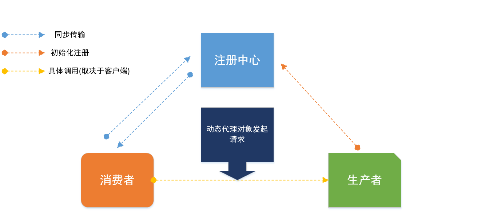

# Simple-Rpc-Framework

Simple-RPC-Framework是一款多注册中心RPC框架 . 网络传输实现了基于 Java 原生 Socket 与 Netty 版本 , 并且实现了多种序列化与负载均衡算法.

## 架构


消费者调用提供者的方式取决于消费者的客户端选择，调用的是动态代理生成的对象，如选用原生 Socket 则该步调用使用 BIO，如选用 Netty 方式则该步调用使用 NIO。如该调用有返回值，则提供者向消费者发送返回值的方式同理。

## 特性

- 目前拥有redis和nacos两种注册中心方案.
- 支持Spring自动注册和发现服务  
- 实现了多种序列化方案,Json,Kryo,Hessian
- 接口抽象良好，模块耦合度低，网络传输、序列化器、负载均衡算法可配置
- 实现自定义的通信协议
- 服务提供侧自动注册服务
- 如果客户端和服务端均使用Netty通信，则会开启心跳监测机制保持连接，复用Channel

## 模块说明

- rpc-common 通用实体对象，工具类
- rpc-core rpc核心实现
- rpc-api 通用接口，测试用
- test-client 消费端测试
- test-server 服务端测试

## 传输协议（SRF协议）

调用参数与返回值的传输采用了如下 SRF 协议（ Simple-RPC-Framework 首字母）以防止粘包：

```
+---------------+---------------+-----------------+-------------+
|  Magic Number |  Package Type | Serializer Type | Data Length |
|    4 bytes    |    4 bytes    |     4 bytes     |   4 bytes   |
+---------------+---------------+-----------------+-------------+
|                          Data Bytes                           |
|                   Length: ${Data Length}                      |
+---------------------------------------------------------------+
```

| 字段            | 解释                                                         |
| :-------------- | :----------------------------------------------------------- |
| Magic Number    | 魔数，表识一个 SRF 协议包，0xCAFEBABE                        |
| Package Type    | 包类型，标明这是一个调用请求还是调用响应                     |
| Serializer Type | 序列化器类型，标明这个包的数据的序列化方式                   |
| Data Length     | 数据字节的长度                                               |
| Data Bytes      | 传输的对象，通常是一个`RpcRequest`或`RpcClient`对象，取决于`Package Type`字段，对象的序列化方式取决于`Serializer Type`字段。 |

## 使用

### 定义调用接口
```java
public interface HelloService {
    String hello(HelloObject object);
}
```

### 在服务提供侧实现该接口
```java
@RpcService
public class HelloServiceImpl implements HelloService {
    @Override
    public String hello(HelloObject object) {
        logger.info("接收到消息：{}", object.getMessage());
        return object.getMessage();
    }
}
```
### 编写服务提供者
```java
@RpcServiceScans("cn.lzheng.test")
public class RegistryTest {
    public static void main(String[] args) {
        //socket
        SocketServer socketServer = new SocketServer("127.0.0.1", 6080);
        socketServer.start();
        
        //Netty
        NettyServer nettyServer = new NettyServer("127.0.0.1",
                RegistryCode.NACOS.getCode(),
                "127.0.0.1:8848");
        nettyServer.start();
    }
}
```
使用默认的nacos为注册中心,kryo序列化

### 在服务消费侧远程调用
```java
public class test {
    public static void main(String[] args) {
        SocketClient socketClient = new SocketClient();
        RpcClientProxy rpcClientProxy = new RpcClientProxy(socketClient);
        HelloService proxy = rpcClientProxy.getProxy(HelloService.class);
        HelloObject helloObject = new HelloObject(12, "??");
        System.out.println(proxy.hello(helloObject));
    }
}
```

## Spring支持

### @RpcReference注解标注为Rpc服务接口
```java
@Service
public class testService {
    @RpcReference
    HelloService helloService;
}
```

### 客户端调用
```java
@ComponentScan("cn.lzheng.rpc.test")
@Configuration
@EnableSimpleRpc
public class test {
    //socket
    @Bean
    public RpcClient socketClient(){
        return new SocketClient("192.168.123.17:8848", RegistryCode.NACOS.getCode());
    }
    //Netty
    @Bean
    public RpcClient socketClient(){
        return new NettyClient("127.0.0.1:8848", RegistryCode.NACOS.getCode());
    }
    
    public static void main(String[] args) {
        ApplicationContext applicationContext =
                new AnnotationConfigApplicationContext(test.class);
        testService bean = applicationContext.getBean(testService.class);
        bean.getHelloService().hello(new HelloObject(1,"hello"));
    }
}

```
@EnableSimpleRpc开启Rpc服务

注入RpcClient,可以用Netty或者Socket的实现类